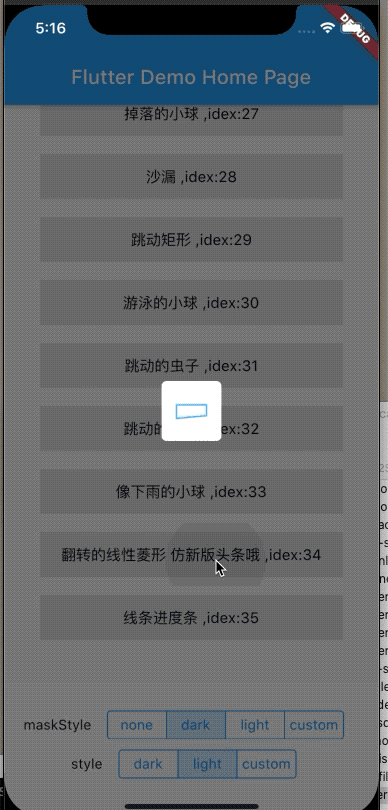

# flutter_easyhub


> A pure flutter, supporting android and iOS, no native code, simpler loading animation, more than 20 existing animations, support for custom foreground and background colors.


|[中文文档](README_CN.md)|English documentation|
|:-:|:-:|

## easy use to use this package as a library

```dart
dependencies:
  flutter_easyhub: ^1.0.1

$ flutter pub get

import 'package:flutter_easyhub/flutter_easy_hub.dart';
```
### how to use
```dart
class MyApp extends StatelessWidget {
  @override
  Widget build(BuildContext context) {
    return MaterialApp(
      title: 'Flutter Demo',
      theme: ThemeData(
        primarySwatch: Colors.blue,
      ),
      builder: (ctx, child) =>
          FlutterEasyHub(child: MyHomePage(title: 'Flutter Demo Home Page')),
    );
  }
}
```

 
then, enjoy yourself:

```dart

EasyHub.show('loading');
EasyHub.show('loading', duration: Duration(seconds: 2));

///toast 2s later dismiss
EasyHub.showInfoHub('network miss');

///default 2s
EasyHub.showMsg('download success');

///default 2s
EasyHub.showErrorHub('An error occurred');

///default 2s
EasyHub.showCompleteHub('done');

/// only hub without msg
/// when you did call EasyHub.dismiss(),it is dismissed;
EasyHub.showHub();

///dismiss
EasyHub.dismiss();

/// custom your widget
EasyHub.showCustom(Container(
child: Text('my test'),
));
  
```

### used just like it
|||
|:--:|:--:|
|||


### how to chose style
#### light
- `style:light`
- `maskStyle:dark`

#### dark
- `style:dark`
- `maskStyle:light`


### change Progress bar color when EasyHubIndicatorType.defaultType

```dart
EasyHub.instance.indicatorType = EasyHubIndicatorType.defaultType;
EasyHub.instance
  ..backgroundColor = Colors.white
  ..animationForegroundColor = AlwaysStoppedAnimation(Colors.red)
  ..style = EasyHubStyle.custom;
EasyHub.showHub();
```

### other EasyHubIndicatorType,you only 

```dart
EasyHub.instance
  ..backgroundColor = Colors.white
  ..animationForegroundColor = AlwaysStoppedAnimation(Colors.red);
```
### when you want touch widget,then hiden it.

```dart 
/// only used for maskStyle!= none.
  EasyHub.instance.onTap = () {
      EasyHub.dismiss();
    };
```
 


### Renderings  Provide more than 30 animations 
| default | CircularProgress| showErrorHub|  showComplateHub |
|:-:|:-:|:-:|:-:|
| LineProgress | CircularProgressEasyOutEasyIn | CircularProgressEasy | singleFlipingRect |
| beattingCircle | singlebeattingCircle | beatingRects | rotatingCircles |
| rotatingDeformedCircles | rotatingTwoRect | rotatingTwoCircles | foldingRect |
| <br> pendulumingBall | <br>waves | spitBubbles | movingCube |
| rotatingTwoColorBall | dancingBall | flashingBalls|fallingBall|
|<br>hourglass| dancingCube| swingingBall| creepingBug|
|<br> rubberBand|rainCouplet| flipDiamond| <br>fragmentRect|


### Customize

```dart
/// just available when [EasyHubType] is [msg]

  String msg;

  /// msg of padding ,used for [EasyHubType.all] and [EasyHubType.msg]
  EdgeInsets msgPadding;

  /// msg of margin ,used for [EasyHubType.all] and [EasyHubType.msg]
  EdgeInsets msgMargin;

  ///  style of msg,used for [EasyHubStyle.custom]
  TextStyle textStyle;

  ///  color of msg font,used for [EasyHubStyle.custom]
  ///  if textStyle is not null, it is ignored
  Color fontColor;

  ///maskStyle. default [EasyHubMaskStyle.dark]
  EasyHubMaskStyle maskStyle;

  /// center view style
  /// default [EasyHubType.all]
  EasyHubStyle style;

  /// loading indicator type, default  [EasyHubType.all]
  EasyHubType _easyHubType;

  /// Animation type
  /// see detail in [EasyHubIndicatorType]
  /// when [EasyHubType] is [hub] or [all],it is available.

  EasyHubIndicatorType indicatorType;

  /// color of Mask,only used for [EasyHubMaskStyle.custom]
  Color maskColor;

  ///color of  main View background
  /// used  for [EasyHubStyle.custom]
  Color backgroundColor;

  ///color of main animation background
  ///used for most of  [EasyHubIndicatorType]
  ///when animationWidget colors more than [two], ignored.
  Color animationBackgroundColor;

  /// main animation foreground color,type is [Animation<Color>]
  /// like[AlwaysStoppedAnimation]
  /// used for most of  [EasyHubIndicatorType]
  ///  when animationWidget colors more than [two], ignored.
  Animation<Color> animationForegroundColor;

  /// animation progress value [bounds] is [0...1]
  /// used for   [EasyHubIndicatorType.lineProgress]
  /// TODO - [EasyHubIndicatorType.waves]
  double progress; //进度条
  /// display duration of [showSuccess] [showErrorHub] [showCompleteHub], default 2000ms.
  Duration displayDuration;

  /// touch action
  /// you can set dismissed when touch
  /// ```dark
  /// EasyHub.instance.onTap = () {
  ///        EasyHub.dismiss();
  ///      };
  /// ```
  GestureTapCallback onTap;

```

 
## [see example](./example/lib/main.dart)
##  enjoy youself with animation if you only like animations;

 > any animation is widget,you can use it ,[see detail](https://github.com/ifgyong/flutter_easyHub/blob/master/lib/tool/Util.dart)

 

## [喜欢的可以✨哦](https://github.com/ifgyong/flutter_easyHub)

## License
[MIT LICENSE](./LICENSE)

## CHANGELOG
[CHANGELOG](./CHANGELOG.md)


