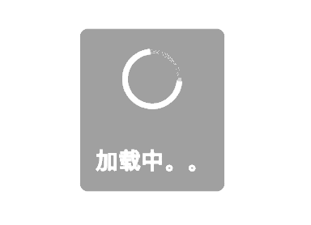
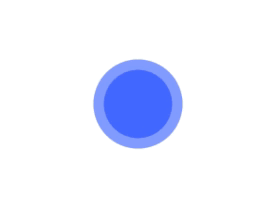
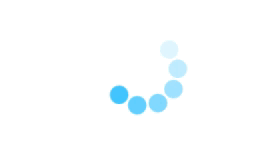
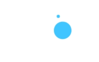
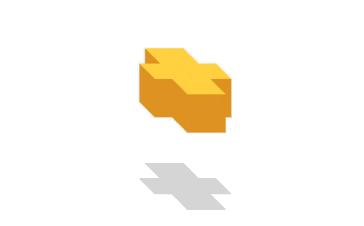
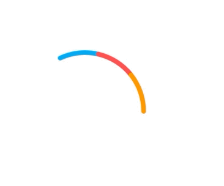

#flutter_easyhub


> 简单易用的toast动画，支持iOS和android，支持widget添加，纯flutter，现在有近30种动画可供选择。

|中文文档|[English documentation](README.md)|
|:-:|:-:|


## 添加依赖

```dart
dependencies:
  flutter_easyhub: ^*.*.*

$ flutter pub get

import 'package:flutter_easyhub/flutter_easyhub.dart';
```
### 简单使用
```dart
class MyApp extends StatelessWidget {
  @override
  Widget build(BuildContext context) {
    return MaterialApp(
      title: 'Flutter Demo',
      theme: ThemeData(
        primarySwatch: Colors.blue,
      ),
      builder: (ctx, child) =>
          FlutterEasyHub(child: MyHomePage(title: 'Flutter Demo Home Page')),
    );
  }
}
```

 
可以开心的使用了😄:

```dart

EasyHub.show('loading');
EasyHub.show('loading', duration: Duration(seconds: 2));

///默认2秒消失
EasyHub.showInfoHub('network miss');

///默认2秒消失
EasyHub.showMsg('download success');

///默认2秒消失
EasyHub.showErrorHub('An error occurred');

///默认2秒消失
EasyHub.showCompleteHub('done');

/// 当你紧紧使用动画，那么请使用`EasyHub.dismiss()`来隐藏它。
EasyHub.showHub();

///隐藏
EasyHub.dismiss();

/// 自定义小部件
EasyHub.showCustom(Container(
child: Text('my test'),
));
  
```

### used just like it
|||
|:--:|:--:|
|||


### `style`如何搭配更香呢
#### 白天模式
- `style:light`
- `maskStyle:dark`

#### 晚上模式
- `style:dark`
- `maskStyle:light`


### 改变进度条颜色 当是默认的type时候`EasyHubIndicatorType.defaultType`

```dart
EasyHub.instance.indicatorType = EasyHubIndicatorType.defaultType;
EasyHub.instance
  ..backgroundColor = Colors.white
  ..animationForegroundColor = AlwaysStoppedAnimation(Colors.red)
  ..style = EasyHubStyle.custom;
EasyHub.showHub();
```

### 其他的动画类型 只有前景色和背景可用哦

```dart
EasyHub.instance
  ..backgroundColor = Colors.white
  ..animationForegroundColor = AlwaysStoppedAnimation(Colors.red);
```
### 用户点击 动画或背景消失

```dart 
/// only used for maskStyle!= none.
  EasyHub.instance.onTap = () {
      EasyHub.dismiss();
    };
```
 


### 30种动画效果 
| default | CircularProgress| showErrorHub|  showComplateHub |
|:-:|:-:|:-:|:-:|
| LineProgress | CircularProgressEasyOutEasyIn | CircularProgressEasy | singleFlipingRect |
| beattingCircle | singlebeattingCircle | beatingRects | rotatingCircles |
| rotatingDeformedCircles | rotatingTwoRect | rotatingTwoCircles | foldingRect |
| <br> pendulumingBall | <br>waves | spitBubbles | movingCube |
| rotatingTwoColorBall | dancingBall | flashingBalls|fallingBall|
|<br>hourglass| dancingCube| swingingBall| creepingBug|
|<br> rubberBand|rainCouplet| flipDiamond| <br>fragmentRect|


### 属性

```dart
/// 当EasyHubType是 msg可用

  String msg;

  /// msg的内边框，当是[EasyHubType.all] and [EasyHubType.msg]可用
  /// 
  EdgeInsets msgPadding;

  /// msg的外边框   ,当[EasyHubType.all] and [EasyHubType.msg]可用
  EdgeInsets msgMargin;

  /// 自定义文本样式，紧紧[EasyHubStyle.custom]可用
  TextStyle textStyle;

 
  /// 文本的颜色，仅仅EasyHubStyle.custom 可用，如果本文设置了textStyle，则被忽略
  Color fontColor;

  /// 遮罩类型 默认[EasyHubMaskStyle.dark]
  EasyHubMaskStyle maskStyle;

  /// 展示 动画和msg的类型 默认是都展示
  EasyHubStyle style;

  /// loading indicator type, default  [EasyHubType.all]
  /// 动画类型 默认是
  EasyHubType _easyHubType;

  
 /// 动画类型 
  EasyHubIndicatorType indicatorType;

  /// 当EasyHubMaskStyle.custom，设置遮罩颜色
  Color maskColor;

  /// 当EasyHubMaskStyle.custom，设置背景颜色
  Color backgroundColor;


  /// 动画背景 在大多数[EasyHubIndicatorType]可用，当动画颜色多于2中时，则该参数被忽略
  Color animationBackgroundColor;


  /// 动画前景色 类型是[Animation<Color>]
  /// 当动画颜色多于2中时，则该参数被忽略
  Animation<Color> animationForegroundColor;

  /// 动画的value范围是[0...1]
  /// 仅仅在type是 [EasyHubIndicatorType.lineProgress]可用
  /// TODO - [EasyHubIndicatorType.waves]
  double progress; //进度条
  /// display duration of [showSuccess] [showErrorHub] [showCompleteHub], default 2000ms.
  /// 默认展示msg 时间 ，默认是2000ms
  Duration displayDuration;

  /// 点击消失
  /// ```dark
  /// EasyHub.instance.onTap = () {
  ///        EasyHub.dismiss();
  ///      };
  /// ```
  GestureTapCallback onTap;

```

 
## [查看例子](./example/lib/main.dart)
##  仅仅使用动画效果

 > 如果仅仅想使用动画，请看 仔细看下该文件。[see detail](https://github.com/ifgyong/flutter_easyHub/blob/master/lib/tool/Util.dart)

 

## [喜欢的可以✨✨✨](https://github.com/ifgyong/flutter_easyHub)

## 证书
[MIT LICENSE](./LICENSE)

## 版本记录
[CHANGELOG](./CHANGELOG.md)


